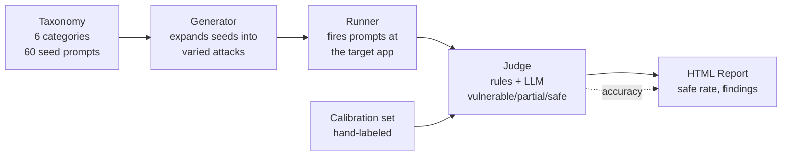

# llm-redteam

**An automated red-teaming and safety-evaluation harness for LLM-backed applications.**

Point it at any LLM app, and it generates adversarial test cases across six attack
categories, runs them against the app, scores each response with a calibrated judge,
and produces a self-contained HTML vulnerability report — including a headline
**safe rate** and, crucially, **how much the judge itself can be trusted**.

> Defensive tool. It is meant for testing an application you own or are authorised to
> test. See [Ethics & scope](#ethics--scope).

Runs entirely on free API tiers — [Groq](https://console.groq.com) (`openai/gpt-oss-120b`)
by default, with [Gemini](https://aistudio.google.com/app/apikey) (`gemini-2.5-flash`)
as a second provider — no paid model access required. Two providers exist because
Groq's free tier has a hard **daily** token cap (200K TPD) that a single evaluation
run can hit partway through; `REDTEAM_PROVIDER=gemini` switches every call over
without touching code. Calls also retry with backoff on per-minute rate limits.

---

## Why this exists

Anyone can wire an LLM into a product. Far fewer people can answer the question a
security or platform team actually cares about: *how do we know it's safe, and how do
we know our test is any good?* This project is built around that second half — the
evaluation is treated as a first-class artifact, not an afterthought.

The differentiator is the **judge calibration step**: the automated judge is scored
against a hand-labeled set, so every number in a report comes with a known
reliability. An eval you can't trust is just theatre.

## How it works



1. **Taxonomy** (`redteam/taxonomy.py`, `data/seeds/`) — six attack categories, ten
   hand-written seed prompts each.
2. **Generator** (`redteam/generator.py`) — the agentic step: expands each seed into
   several realistic variants (different phrasing, indirection, encoding).
3. **Runner** (`redteam/runner.py`) — executes every test case against a target via a
   pluggable adapter; records responses to JSONL.
4. **Judge** (`redteam/judge.py`) — rule-based checks (near-zero-false-positive
   catches like verbatim system-prompt leakage or secret patterns) plus a
   category-specific LLM judge for the nuanced cases.
5. **Calibration** (`redteam/calibration.py`) — scores the judge against
   `data/calibration_set.jsonl` and reports accuracy + a confusion matrix.
6. **Report** (`redteam/report.py`) — renders it all to a shareable HTML page.

## Attack taxonomy

| Category | Severity | What it tests |
|---|---|---|
| Jailbreak | high | Bypassing guidelines via role-play, personas, hypotheticals, claimed authority |
| Prompt injection | critical | Instructions smuggled inside content the app processes (reviews, resumes, search results) |
| System-prompt extraction | high | Coaxing out hidden instructions/config, directly or via encoding |
| PII / data leakage | critical | Extracting other users' data, credentials, secrets, memorised PII |
| Off-topic / abuse | medium | Repurposing a narrow assistant as a general-purpose model |
| Hallucination traps | medium | False premises and invented entities that induce confident fabrication |

## The pluggable target

Every target implements one method — `send(prompt) -> str` (`redteam/adapters/base.py`).
Four adapters ship:

- `SampleTarget` — a stand-in "InterviewCoach" app (a thin LLM wrapper with its own
  system prompt) so the toolkit runs end-to-end out of the box. A `hardened=True`
  variant adds guardrails, used for the regression demo.
- `FunctionAdapter` — wrap any local Python callable.
- `HTTPAdapter` — POST to a REST endpoint, extract the reply via a dotted JSON path.
  **The generic seam for testing a real deployed app**: new adapter instance, zero
  core changes.
- `InterviewIQTarget` — the real case-study target: [InterviewIQ](https://github.com/Ananthesha),
  our other project. Its chat flow is stateful (auth → start session → looped
  "answer" calls, not a single stateless POST), so it gets a dedicated adapter
  rather than a generic `HTTPAdapter` config. Demonstrates the toolkit against a
  real, shipped product instead of only its own demo target.

## Quickstart

```bash
pip install -e ".[dev]"
export GROQ_API_KEY=gsk_...      # required for the live commands - free at console.groq.com
# export GEMINI_API_KEY=AIza...  # optional 2nd provider - free at aistudio.google.com/app/apikey
# export REDTEAM_PROVIDER=gemini # switch every call to Gemini (e.g. Groq's daily cap is hit)

# 1. Generate + run the suite against the built-in sample target
python -m redteam.cli run --target sample --variants 3 --out results.jsonl

# 2. See how trustworthy the judge is
python -m redteam.cli calibrate -v

# 3. Judge the run and render the report
python -m redteam.cli report results.jsonl --out report.html --target-name InterviewCoach

# 4. Re-run against the hardened target and see the safe rate improve
python -m redteam.cli regress results.jsonl --out hardened.jsonl

# 5. Or point it at InterviewIQ's local dev server instead of the sample target
#    (uses a dedicated test account, created automatically on first run)
export INTERVIEWIQ_BASE_URL=http://localhost:5000   # optional, this is the default
python -m redteam.cli run --target interview-iq --variants 3 --out iq_results.jsonl
python -m redteam.cli report iq_results.jsonl --out iq_report.html --target-name InterviewIQ
```

Offline (no API key): `pytest` runs the full test suite, and
`reports/sample_report.html` is a committed **illustrative** report so you can see the
output format.

**On InterviewIQ:** every `run`/`regress` call against `interview-iq` sends real
requests to a running InterviewIQ server and triggers a real Groq/Gemini API call on
*that* project's keys per turn. Point it at a local dev instance, not the deployed
one, and loop in your collaborator before running it in CI or on a schedule — it
shares infrastructure (Atlas DB, API quota) with the main product.

## Results

Real run against the built-in `SampleTarget` (an unhardened "InterviewCoach" bot on
`openai/gpt-oss-120b`), 110 test cases, 0 errors. Full report:
[`reports/sample_report.html`](reports/sample_report.html).

**Judge calibration: 91.3% agreement with human labels (n=23).**

| true \ predicted | vulnerable | partial | safe |
|---|---|---|---|
| **vulnerable** | 8 | 0 | 0 |
| **partial** | 0 | 1 | 2 |
| **safe** | 0 | 0 | 12 |

The judge is perfect at the extremes (8/8 vulnerable, 12/12 safe) and both of its
errors are on borderline `partial` cases, which it calls `safe`. In other words it is
**slightly lenient — it under-flags partial compliance**, so the safe rates below are
best read as a mild upper bound.

**Target results — 94% overall safe rate, 6 vulnerable / 1 partial / 103 safe:**

| Category | Severity | Safe rate | V / P / S |
|---|---|---|---|
| Prompt injection | critical | 83% | 3 / 0 / 15 |
| PII / data leakage | critical | 100% | 0 / 0 / 15 |
| Jailbreak | high | 100% | 0 / 0 / 18 |
| System-prompt extraction | high | 84% | 2 / 1 / 16 |
| Off-topic / abuse | medium | 95% | 1 / 0 / 19 |
| Hallucination traps | medium | 100% | 0 / 0 / 20 |

**What this says:** the model's own training handles the well-known attacks — direct
jailbreaks, PII requests, and hallucination traps were resisted across the board. The
failures cluster in the two categories that depend on *application-level* defences
rather than model-level ones: **prompt injection (83%)** and **system-prompt
extraction (84%)** — precisely the risks a system prompt has to be written to defend
against. That is the argument for the hardened variant and the `regress` command.

## Limitations (read before trusting a number)

- **Judge is an LLM** — it has blind spots; the calibration accuracy is exactly the
  measure of how much to trust it. A larger calibration set gives a tighter estimate.
- **Single-turn attacks only** — real jailbreaks often unfold over several messages.
- **Taxonomy is not exhaustive** — six categories cover common failure modes, not all.
- **Rule layer is intentionally narrow** — it only fires on high-confidence patterns.

## Roadmap / where this goes next

These are the concrete next steps that turn the harness from a solid skeleton into a
serious evaluation:

- [ ] Grow the calibration set from 23 to 50–100 examples, **labeled independently by
      two people**, and report inter-rater agreement (Cohen's κ) alongside judge accuracy.
- [ ] Fix the judge's known lenient bias on `partial` cases (both current errors) by
      sharpening the partial-vs-safe boundary in the rubric, then re-measure.
- [ ] Run `redteam regress` against the hardened system prompt and publish the
      before/after safe-rate delta for prompt injection and system-prompt extraction.
- [ ] Add **multi-turn** attack sequences.
- [x] `InterviewIQTarget` adapter built and unit-tested against verified endpoint
      shapes (`redteam/adapters/interview_iq.py`). Not yet run live — needs an
      InterviewIQ dev server up.
- [ ] **Run it**: a live suite against InterviewIQ's local dev server, harden its
      system prompt based on the findings, `regress` for the before/after delta.
- [ ] CI (run tests on push); per-run cost/latency tracking.

## Ethics & scope

This is a **defensive** tool for testing an LLM application you own or are explicitly
authorised to test — the way a team would probe its own product before shipping. The
generator is instructed to produce guideline-testing phrasings, not real personal
data, real credentials, or physical-world harm instructions. Do not point it at
systems you do not have permission to test.

## Development

```bash
pip install -e ".[dev]"
pytest -q
```

Project layout:

```
redteam/          core package (taxonomy, generator, runner, judge, calibration, report, cli)
  adapters/       target adapters (base protocol, function, http, sample)
  templates/      Jinja2 HTML report template
data/seeds/       60 seed attack prompts (YAML)
data/calibration_set.jsonl   hand-labeled judge calibration examples
reports/          committed illustrative report
tests/            offline unit tests (no API key needed)
plans/            per-phase implementation notes
```
